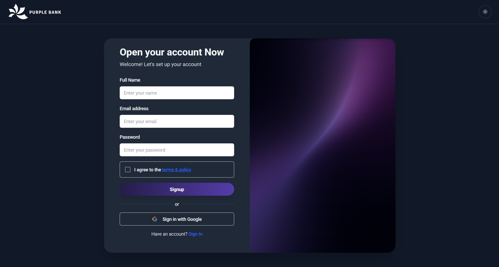
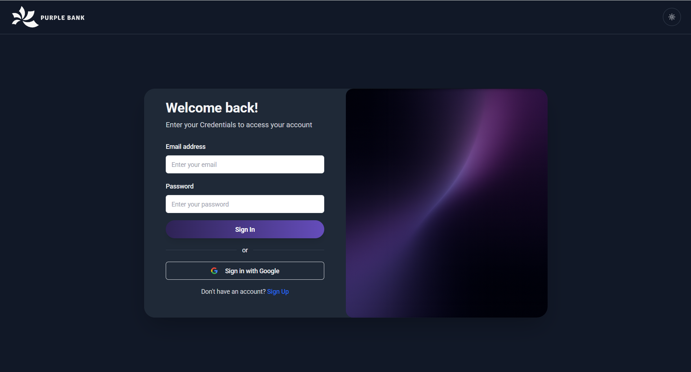

# 🪙 BankApp

A simple money transaction web app built for learning and practice purposes.

## 📝 Description

BankApp is a simple web application that allows users to create an account, log in, send money to other users, view their transaction history, and log out.  
It was developed as a personal practice project after returning from maternity leave, to refresh and strengthen my development skills.

Both frontend and backend are implemented, though they have not yet been fully integrated or tested together.  
Future improvements include adding features such as real-time updates using Socket.IO, refining the codebase, fixing bugs, improving the frontend design, and enhancing overall functionality.

## 🛠️ Tech Stack

**Development Environment**

-   Cursor IDE

**Backend**

-   Node.js
-   TypeScript
-   Express (REST API)
-   Prisma ORM
-   PostgreSQL (Neon)
-   Jest & Supertest
-   Swagger (API documentation)

**Frontend**

-   React.js
-   Vite
-   TypeScript
-   Tailwind CSS
-   shadcn/ui
-   Figma
-   AI tools: Stitch, Magic Patterns

## 🚀 Installation / Usage

This is a personal practice project and is currently **not deployed**.

Since environment variables and full setup are not included, the project cannot be run locally by others at this time.

## 👩‍💻 Author

**Lilach Rabinovich** – [LinkedIn](https://www.linkedin.com/in/lilach-rabinovich)

## 🖼️ Screenshots / Preview

Since the project is not deployed, here are some screenshots of the web app (shown in dark mode, light mode also supported):

### Home Page

### Signup Page

### Signin Page

### Dashboard Page

### Send Money Demo

## 🚧 Project Status

The project is mostly complete but currently inactive. It was created as a personal practice project and may be updated or improved in the future.
